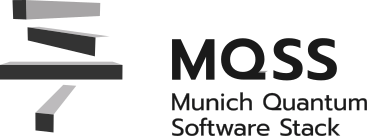

<!----------------------------------------------------------------------------
Copyright 2024 Munich Quantum Software Stack Project

Licensed under the Apache License, Version 2.0 with LLVM Exceptions (the
"License"); you may not use this file except in compliance with the License.
You may obtain a copy of the License at

https://github.com/Munich-Quantum-Software-Stack/MQSS-SLURM-Plugins-Suite/blob/develop/LICENSE

Unless required by applicable law or agreed to in writing, software
distributed under the License is distributed on an "AS IS" BASIS, WITHOUT
WARRANTIES OR CONDITIONS OF ANY KIND, either express or implied. See the
License for the specific language governing permissions and limitations under
the License.

SPDX-License-Identifier: Apache-2.0 WITH LLVM-exception
--------------------------------------------------------------------------->

<p align="center">
  
</p>

# MQSS SLURM Plugins Suite

<p align="center">
  <a href="https://munich-quantum-software-stack.github.io/MQSS-SLURM-Plugins-Suite/">
    
  </a>
  &nbsp;
  <a href="https://github.com/Munich-Quantum-Software-Stack/MQSS-SLURM-Plugins-Suite/actions/workflows/ci.yml">
    
  </a>
</p>

An example suite of SLURM plugins for integrating Quantum Processing Units (QPUs) into HPC
workloads. Quantum resources are exposed to SLURM as co-processors (or can be considered as
accelerators like GPUs), allowing standard job scripts to request and use QPU time. Plugins can be
implemented via two SLURM extension mechanisms — **SPANK** or **Prolog/Epilog** — so they plug in
and out without modifying the SLURM source code.

## FAQ

### What is MQSS?

_MQSS_ stands for _Munich Quantum Software Stack_ and is a project of the _Munich Quantum Valley_
initiative. It is jointly developed by the _Munich Quantum Valley (MQV) gGmbH_, _Leibniz
Supercomputing Centre (LRZ)_, the _Chair for Design Automation (CDA)_, and the _Chair of Computer
Architecture and Parallel Systems (CAPS)_ at TUM. It provides a comprehensive compilation and
runtime infrastructure for on-premise and remote quantum devices, support for modern compilation and
optimization techniques, and enables both current and future high-level abstractions for quantum
programming. This stack is designed to be capable of deployment in a variety of scenarios via
flexible configuration options. This includes stand-alone scenarios for individual systems, cloud
access to a variety of devices, as well as tight integration into HPC environments supporting
quantum acceleration. Concrete instances of the _MQSS_ are deployed at the LRZ and MQV gGmbH,
providing unified access to all of their quantum devices through multiple compatible access paths.
This includes a web portal, command line access via web credentials, as well as the option for
hybrid access with tight integration with HPC systems. It facilitates the connection between
end-users and quantum computing platforms by its integration within HPC infrastructures, such as
those found at the LRZ.

### Where is the code?

The code is publicly available and hosted on GitHub at
[github.com/Munich-Quantum-Software-Stack/MQSS-SLURM-Plugins-Suite](https://github.com/Munich-Quantum-Software-Stack/MQSS-SLURM-Plugins-Suite).

### Under which license is the MQSS SLURM Plugins Suite released?

The **MQSS SLURM Plugins Suite** is released under the Apache License v2.0 with LLVM Exceptions.
See [LICENSE](LICENSE) for more information. Any contribution to the project is assumed to be under
the same license.

## Architecture

```
+---------------------+
|   SLURM Controller  |  (slurm_master)
+---------------------+
          |
          |  job dispatch
          v
+---------------------+     +-----------------------------+
|   Compute Node      |<--->|  SPANK Plugin (.so)         |
|   (slurm_worker)    |     |  or Prolog/Epilog scripts   |
|                     |     |                             |
+---------------------+     +-----------------------------+
          |   |
          |   | (trigger connection to Quantum Servers)
          v   v
+---------------------+     +-----------------------------+
|   RabbitMQ Server   |<--->|   qdaemon                   |
|   (message broker)  |     |  (Quantum Daemon)           |
+---------------------+     +-----------------------------+
                                        |
                                        |  (Quantum Tasks offloading)
                                        v
                             +--------------------------------------+
                             |  real QPU/Simulator device backends  |
                             +--------------------------------------+
```

- **SLURM Controller** dispatches jobs to compute nodes and manages QPU resources via GRES.
- **SPANK plugins** run automatically at the phases of job prolog/epilog steps on compute nodes, starting and stopping connection to the quantum servers.
- **qdaemon** enables receiving quantum circuits and offloads them to the target QPU or simulator backends.

## Requirements

- SLURM 23.11 (built from source or via package)
- GCC with C99 support (`-std=gnu99`)
- SLURM development headers (`libslurm-dev` on Ubuntu, or built from the SLURM source tree)
- Python 3.10+ with `qdaemon` and dependencies installed (for the quantum daemon)
- RabbitMQ server

## Repository Structure

```
.
├── src/
│   ├── spank_plugin/           # SPANK plugins (compiled to .so)
│   │   ├── load_unload_rabbitmq/   # Start/stop communication brokers at job boundaries
│   │   ├── load_unload_mqss/       # Start/stop communication of quantum daemon
│   │   └── example/                # Minimal SPANK plugin example
│   └── prep_plugin/            # Prolog/Epilog shell scripts (alternative approach)
│       ├── prolog_scripts/         # Run before job starts
│       └── epilog_scripts/         # Run after job ends
├── mqss_scripts/               # Helper scripts to load/unload MQSS components
├── deployment/                 # Setup instructions and config files
│   ├── on_virtual_machines/        # VM-based testbed (Ubuntu 22.04, NFS shared dir)
│   ├── on_docker_containers/       # Docker Compose environment for local dev
│   └── slurm/                      # SLURM build scripts (slurm-23.11)
├── test/                       # Job submission examples and quantum benchmark scripts
└── utils/                      # Utilities (string_preprocess helper, Docker Compose)
```

## Building

### SPANK plugins

Each plugin example has its own `Makefile`. With `libslurm-dev` installed, we can compile the example by simply using `make`.

The resulting `.so` files must be copied to the shared plugin directory on each compute node (default path in the Makefiles: `/spank_plugins/shared_plugins/`):

```bash
make install
```

Then register the plugin in `/etc/slurm/plugstack.conf` on each node:

```
required /path/to/shared_plugins/load_unload_rabbitmq.so
```

Instead of using SPANK, we can also use Prolog/Epilog scripts to trigger the connection to the quantum servers.

## Deployment

Detailed setup guides are in `deployment/`:

| Environment | Guide |
|-------------|-------|
| Virtual machines (Ubuntu 22.04, NFS) | [`deployment/on_virtual_machines/`](deployment/on_virtual_machines/) |
| Docker containers (local dev) | [`deployment/on_docker_containers/`](deployment/on_docker_containers/) |
| SLURM build from source | [`slurm-23.11`](https://github.com/SchedMD/slurm/releases/tag/slurm-23-11-9-1) |

A testbed uses two nodes — `slurm_master` (controller) and `slurm_worker` (compute) — connected via NFS at `/home/ubuntu/shared_nfs_slurm`. Jobs are submitted from `slurm_master`.

## Contact

The development of this project is led by the QCT department at the LRZ. You can reach us at
[mqss@munich-quantum-valley.de](mailto:mqss@munich-quantum-valley.de).

Please use the publicly accessible GitHub channels
([issues](https://github.com/Munich-Quantum-Software-Stack/MQSS-SLURM-Plugins-Suite/issues),
[discussions](https://github.com/Munich-Quantum-Software-Stack/MQSS-SLURM-Plugins-Suite/discussions),
[pull requests](https://github.com/Munich-Quantum-Software-Stack/MQSS-SLURM-Plugins-Suite/pulls))
to allow for a transparent and open discussion as much as possible.

## Contributing

See [CONTRIBUTING.md](CONTRIBUTING.md) and [CODE_OF_CONDUCT.md](CODE_OF_CONDUCT.md).

## License

This project is released under the Apache License v2.0 with LLVM Exceptions. See [LICENSE](LICENSE) for more information. Any contribution to the project is assumed to be under the same license.